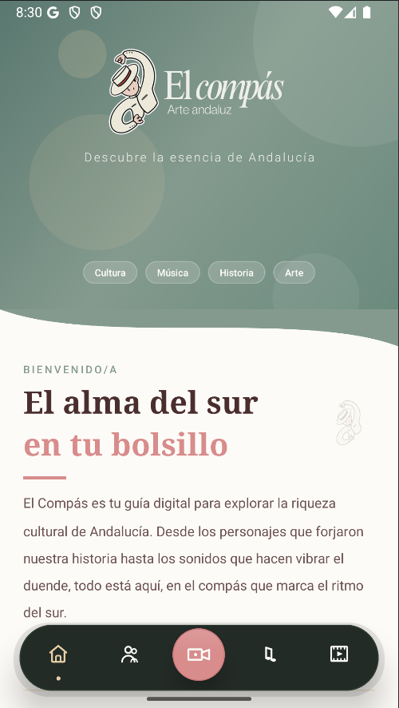
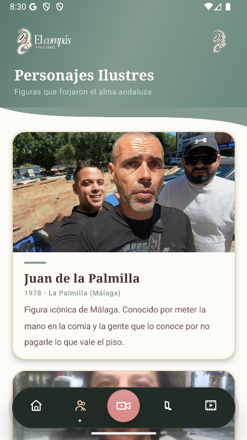
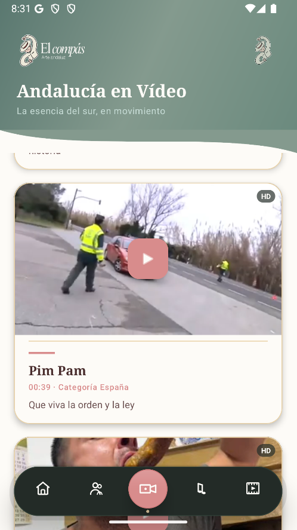
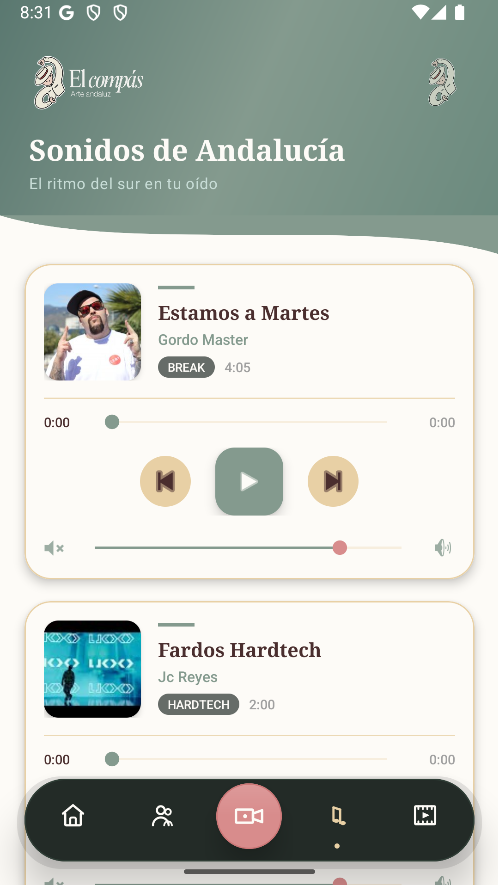
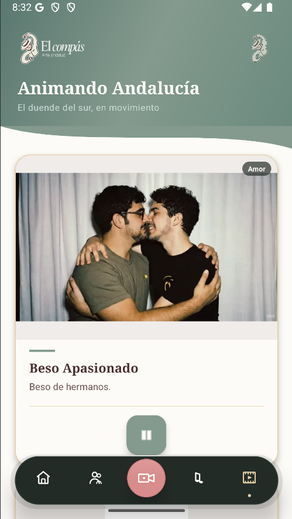

<div align="center">



# 🎵 El Compás

### *"Andalucía no se explica, se siente en cada compás."*

**Desarrollado por [Ecentia](https://github.com/Ecentia)**  
IES Francisco Rodríguez Marín · Osuna, Sevilla · DAM 2025–2026

---


</div>

---

## 📖 Tabla de Contenidos

1. [Descripción del Proyecto](#-descripción-del-proyecto)
2. [Capturas de Pantalla](#-capturas-de-pantalla)
3. [Características Principales](#-características-principales)
4. [Arquitectura y Stack Tecnológico](#-arquitectura-y-stack-tecnológico)
5. [Estructura del Proyecto](#-estructura-del-proyecto)
6. [Flujo de la Aplicación](#-flujo-de-la-aplicación)
7. [Secciones de la App](#-secciones-de-la-app)
   - [Splash Screen](#-splash-screen)
   - [Inicio](#-inicio)
   - [Personajes Ilustres](#-personajes-ilustres)
   - [Andalucía en Vídeo](#-andalucía-en-vídeo)
   - [Sonidos de Andalucía](#-sonidos-de-andalucía)
   - [Animando Andalucía](#-animando-andalucía)
8. [Bottom Navigation Custom](#-bottom-navigation-custom)
9. [Paleta de Colores y Diseño](#-paleta-de-colores-y-diseño)
10. [Recursos Drawable](#-recursos-drawable)
11. [Modelos de Datos (Entidades)](#-modelos-de-datos-entidades)
12. [Adaptadores](#-adaptadores)
13. [Dependencias](#-dependencias)
14. [Instalación y Configuración](#-instalación-y-configuración)
15. [Cómo Añadir Contenido](#-cómo-añadir-contenido)
16. [Autores](#-autores)

---

## 🌍 Descripción del Proyecto

**El Compás** es una aplicación Android nativa desarrollada íntegramente en **Java** como proyecto final del ciclo formativo de **Desarrollo de Aplicaciones Multiplataforma (DAM)** en el IES Francisco Rodríguez Marín de Osuna (Sevilla). El proyecto es obra de **Ecentia**, el equipo de desarrollo formado por los propios alumnos durante el curso 2025–2026.

La app es una guía cultural interactiva de Andalucía que reúne en un solo lugar personajes representativos de la región, vídeos característicos con reproductor integrado, música de diferentes géneros con control completo de reproducción, y animaciones Lottie. Todo ello presentado bajo una identidad visual consistente, con paleta cromática propia, transiciones cuidadas y una bottom navigation completamente custom.

### Filosofía del Proyecto

El diseño y desarrollo de El Compás se sustenta en tres pilares:

**Autenticidad.** El contenido recoge personajes, sonidos y vídeos de cultura popular andaluza, con descripciones cercanas y naturales. No hay filtros de corrección política: el tono es el del sur.

**Calidad técnica.** La arquitectura Fragment + RecyclerView + Adapter desacopla completamente la lógica de presentación de los datos. Los reproductores de audio y vídeo gestionan correctamente su ciclo de vida para evitar fugas de memoria. Las animaciones usan interpoladores físicos (`OvershootInterpolator`) para que cada interacción tenga peso y respuesta.

**Extensibilidad.** Todo el catálogo de contenido está centralizado en métodos `crearListaX()`. Añadir una canción nueva son 6 líneas de código. Añadir un personaje, otras 7. Sin bases de datos, sin APIs remotas, sin complejidad innecesaria.

---

## 📸 Capturas de Pantalla

<div align="center">

| Inicio | Personajes | Vídeos |
|:------:|:----------:|:------:|
|  |  |  |

| Sonidos | Animaciones |
|:-------:|:-----------:|
|  |  |

</div>

---

## ✨ Características Principales

### Pantalla de Carga
- **Splash con Lottie** (`ecentia_splash.json`) a pantalla completa sobre fondo `albero_cream`. La `MainActivity` se lanza automáticamente al terminar la animación mediante `AnimatorListener.onAnimationEnd()`. La activity de splash se cierra con `finish()` para que el botón Atrás no regrese a ella.

### Diseño Visual
- **Bottom Navigation completamente custom** — Píldora flotante `MaterialCardView` con fondo `dark_green`, radio de 34 dp, elevación de 20 dp y sombra exterior con drawable propio (`nav_shadow_outer`).
- **Iconos vectoriales diseñados a medida** — 5 iconos XML con trazos `round` y sin dependencias de PNG.
- **Botón central de Vídeos elevado** — `MaterialCardView` circular de 54 dp en `tile_coral` con highlight interno semitransparente y sombra de 12 dp. Se sobresale ligeramente hacia arriba con `marginBottom="-4dp"`.
- **Indicador activo** — Punto de 4 dp en `yellow_sun` bajo el icono seleccionado.
- **Animación de rebote** (`OvershootInterpolator(2.5)`, 320 ms) al pulsar cualquier botón del nav.
- **Header consistente** en todas las secciones: degradado `bg_hero_header`, logo de El Compás, icono decorativo, título en serif blanco 24 sp y subtítulo en `#C8DDD7`.
- **Wave divider SVG** entre header y contenido en todos los fragments (`ic_wave_divider`, 32 dp).
- Todas las tarjetas de contenido usan `MaterialCardView` con esquinas de 22 dp, elevación de 5 dp y borde `yellow_sun`.

### Reproducción Multimedia
- **ExoPlayer (Media3)** para vídeo con controles personalizados (`exo_player_control_view.xml`): barra `DefaultTimeBar`, retroceso/avance de 10 s, play/pause en `tile_coral`, tiempos en `#FDFBF7`, botón pantalla completa en `sage_green`.
- **Android MediaPlayer** nativo para audio con SeekBar arrastrable, actualización de progreso cada 500 ms, navegación anterior/siguiente con scroll suave al ítem destino y un único player activo globalmente.
- **Lottie** para animaciones JSON en bucle infinito con botón FAB play/pausa y animación de press.
- **Thumbnails automáticos** de vídeo generados en background con `MediaMetadataRetriever` + `AsyncTask`, con fallback al drawable `videos`.

### Gestión del Ciclo de Vida
- Liberación de `MediaPlayer` y `ExoPlayer` en `onPause()` y `onDestroyView()` de cada fragment.
- Las animaciones Lottie se pausan automáticamente al salir de pantalla (`onViewDetachedFromWindow`).
- Un único reproductor activo a la vez tanto en audio como en vídeo: al iniciar uno nuevo, el anterior se detiene y libera antes de crear el siguiente.

---

## 🏗️ Arquitectura y Stack Tecnológico

```
El Compás
├── Patrón         : Activity → Fragment → RecyclerView → Adapter → Entity
├── Lenguaje       : Java 11
├── Namespace      : com.andalucia_app
├── SDK mínimo     : API 24 (Android 7.0 Nougat)
├── SDK compilación: API 36
├── SDK objetivo   : API 36
├── Build system   : Gradle KTS
└── Tema           : Material3.DayNight.NoActionBar
```

### Stack tecnológico

| Componente | Librería | Versión |
|---|---|---|
| UI / Material | `com.google.android.material` | 1.13.0 |
| AppCompat | `androidx.appcompat` | 1.7.1 |
| ConstraintLayout | `androidx.constraintlayout` | 2.2.1 |
| Reproductor vídeo | `androidx.media3:media3-exoplayer` | 1.3.1 |
| UI vídeo | `androidx.media3:media3-ui` | 1.3.1 |
| Reproductor audio | Android `MediaPlayer` | API nativa |
| Animaciones JSON | `com.airbnb.android:lottie` | 6.3.0 |
| Listas | `RecyclerView` | AndroidX |
| Testing | JUnit + Espresso | AndroidX |

---

## 📁 Estructura del Proyecto

```
el-compas/
│
├── app/
│   ├── src/main/
│   │   │
│   │   ├── java/com/andalucia_app/
│   │   │   │
│   │   │   ├── SplashActivity.java          # Lottie splash → lanza MainActivity + finish()
│   │   │   ├── MainActivity.java            # Nav custom: init, clicks, setNavSelected,
│   │   │   │                                #   resetAllNav, animateBounce, selectNavItem,
│   │   │   │                                #   cargarFragment
│   │   │   │
│   │   │   ├── InicioFragment.java          # Hero + grid clickable + autores
│   │   │   ├── PersonajesFragment.java      # 7 personajes
│   │   │   ├── VideosFragment.java          # 6 vídeos ExoPlayer
│   │   │   ├── SonidosFragment.java         # 7 canciones MediaPlayer
│   │   │   ├── AnimacionesFragment.java     # 5 animaciones Lottie
│   │   │   │
│   │   │   ├── adapter/
│   │   │   │   ├── PersonajeAdapter.java
│   │   │   │   ├── VideoAdapter.java        # ExoPlayer activo + ThumbnailTask (AsyncTask)
│   │   │   │   ├── SonidoAdapter.java       # MediaPlayer activo + Handler progreso 500ms
│   │   │   │   └── AnimacionAdapter.java    # Lottie + pausa en onViewDetached
│   │   │   │
│   │   │   └── entity/
│   │   │       ├── Personaje.java
│   │   │       ├── Video.java
│   │   │       ├── Sonido.java
│   │   │       └── Animacion.java
│   │   │
│   │   └── res/
│   │       ├── layout/
│   │       │   ├── activity_main.xml        # FrameLayout + píldora nav
│   │       │   ├── activity_splash.xml      # LottieAnimationView fullscreen
│   │       │   ├── fragment_inicio.xml      # ScrollView completo
│   │       │   ├── fragment_personajes.xml
│   │       │   ├── framgent_videos.xml      # (typo original conservado)
│   │       │   ├── fragment_sonidos.xml
│   │       │   ├── fragment_animaciones.xml
│   │       │   ├── item_personaje.xml
│   │       │   ├── item_video.xml
│   │       │   ├── item_sonido.xml
│   │       │   ├── item_animacion.xml
│   │       │   └── exo_player_control_view.xml
│   │       │
│   │       ├── drawable/
│   │       ├── raw/                         # .mp3, .mp4, .json
│   │       ├── color/
│   │       │   └── nav_item_colors.xml
│   │       ├── menu/
│   │       │   └── bottom_nav_menu.xml
│   │       ├── values/
│   │       │   ├── strings.xml
│   │       │   ├── colors.xml
│   │       │   └── themes.xml
│   │       ├── values-night/
│   │       │   └── themes.xml
│   │       └── xml/
│   │           ├── backup_rules.xml
│   │           └── data_extraction_rules.xml
│   │
│   └── build.gradle.kts
│
├── screenshots/
│   ├── inicio.png
│   ├── personajes.png
│   ├── videos.png
│   ├── sonidos.png
│   └── animaciones.png
│
├── build.gradle.kts
├── settings.gradle.kts          # rootProject.name = "andalucia_app"
├── gradle.properties
├── gradlew / gradlew.bat
└── README.md
```

---

## 🔄 Flujo de la Aplicación

```
Lanzador del Sistema
        │
        ▼
SplashActivity  (Theme.AppCompat.NoActionBar)
  └── LottieAnimationView: ecentia_splash.json  (autoPlay, sin bucle)
  └── onAnimationEnd() → startActivity(MainActivity) + finish()
        │
        ▼
MainActivity  (Theme.Andalucia_app)
  ├── setContentView(activity_main.xml)
  ├── initNavViews()  →  bindea 5 botones, 5 iconos y 5 dots
  ├── setupClickListeners()
  ├── setNavSelected(0)  →  colorActivo en iconInicio, dot visible
  └── cargarFragment(InicioFragment)
        │
        ├── [Nav Inicio]       → InicioFragment
        │     └── setupCardClicks() → animatePress() → navigateTo()
        │               → MainActivity.selectNavItem(index, fragment)
        │
        ├── [Nav Personajes]   → PersonajesFragment
        │     └── crearListaPersonajes() → PersonajeAdapter → RecyclerView
        │
        ├── [Nav Vídeos]       → VideosFragment
        │     └── crearListaVideos() → VideoAdapter → RecyclerView
        │           └── ExoPlayer único por sesión + ThumbnailTask
        │
        ├── [Nav Sonidos]      → SonidosFragment
        │     └── crearListaSonidos() → SonidoAdapter → RecyclerView
        │           └── MediaPlayer único + Handler 500ms + scroll prev/next
        │
        └── [Nav Animaciones]  → AnimacionesFragment
              └── crearListaAnimaciones() → AnimacionAdapter → RecyclerView
                    └── Lottie INFINITE + pausa onViewDetached
```

---

## 📱 Secciones de la App

### 🎬 Splash Screen

`SplashActivity` carga `activity_splash.xml`, que contiene un único `LottieAnimationView` ocupando toda la pantalla (`0dp` con constraints a los cuatro bordes) sobre fondo `albero_cream`. La animación `ecentia_splash.json` se reproduce con `lottie_autoPlay="true"`. Al terminar (`onAnimationEnd`), se lanza `MainActivity` y se llama `finish()` para eliminar el splash de la pila de actividades e impedir que el botón Atrás regrese a él.

---

### 🏠 Inicio

`InicioFragment` infla `fragment_inicio.xml`, un `ScrollView` con `paddingBottom="110dp"` para no quedar tapado por la bottom nav. Contiene los siguientes bloques:

**Hero (320 dp, fondo `bg_hero_header`):**
Cuatro círculos decorativos semitransparentes en esquinas para dar profundidad. Logo centrado (100 dp alto), subtítulo "Descubre la esencia de Andalucía" en `sans-serif-light`, y cuatro chips en la parte inferior (`Cultura · Música · Historia · Arte`) con fondo `hero_chip_bg`.

**Wave divider** (38 dp, `ic_wave_divider` con `fitXY`).

**Sección de bienvenida:** tag "BIENVENIDO/A" en `sage_green`, título tipográfico en dos líneas — *"El alma del sur"* en `text_dark_brown` y *"en tu bolsillo"* en `tile_coral` — separador de 44×3 dp coral, descripción en prosa.

**Fila de iconos culturales:** 7 imágenes PNG de 24 dp (`abanico`, `aplausos`, `flor`, `pomo_guitarra`, `maracas`, `peineta`, `decoracion`).

**Grid 2×2 de secciones clickables (tarjetas de 130 dp):**

| Card | Color fondo | Icono | Target |
|------|-------------|-------|--------|
| Personajes | `sage_green` | `personajes.png` | `PersonajesFragment` (index 1) |
| Vídeos | `tile_coral` | `videos.png` | `VideosFragment` (index 2) |
| Sonidos | `yellow_sun` | `sonidos.png` | `SonidosFragment` (index 3) |
| Animaciones | `green_light` | `animaciones.png` | `AnimacionesFragment` (index 4) |

Al pulsar una tarjeta, `animatePress()` ejecuta scale down a 0.93 en 90 ms + rebote `OvershootInterpolator(2.5)` en 160 ms, y al terminar llama `MainActivity.selectNavItem()`.

**Pull-quote** sobre fondo `sage_green`: comillas decorativas 52 sp (alpha 0.35), cita en serif italic: *"Andalucía no se explica, se siente en cada compás."*, icono El Compás en esquina (alpha 0.35).

**¿Sabías que…?** Tarjeta `albero_cream` con borde `yellow_sun`, icono flor y dato sobre Andalucía.

**Tarjeta de autores** sobre `dark_green`: nombre del instituto en serif white, localidad en `sage_green`, tres filas con foto circular de 40 dp y nombre, footer con curso "Curso 2025–2026 · DAM" y badge `v1.0`.

---

### 👥 Personajes Ilustres

`PersonajesFragment` crea la lista en `crearListaPersonajes()` y la pasa a `PersonajeAdapter`. Cada ítem (`item_personaje.xml`) muestra foto del personaje a 200 dp con `scaleType` dinámico (definido por el campo `rellenarImagen` de la entidad), overlay degradado `bg_image_overlay`, línea decorativa `sage_green`, nombre en serif bold 20 sp, época en `sage_green`, y descripción en 14 sp.

**Personajes incluidos:**

| Nombre | Año · Localidad | Categoría |
|--------|-----------------|-----------|
| Juan de la Palmilla | 1978 · La Palmilla (Málaga) | Artista |
| 'Faliyo' de San Roque | 2000 · San Roque (Cádiz) | Personaje |
| José Ángel 'Patica' | 1996 · Cacín (Granada) | Historia |
| Juan Alberto 'LMDShow' | 1994 · Fuengirola (Málaga) | Streamer |
| Luis 'Comandante' Lara | 1976 · Jerez de la Frontera (Cádiz) | Comediante |
| Juan Manuel Cortés 'JC' Reyes | 1997 · Sevilla | Cantante |
| Hermanos 'Midudan' | 1995 & 2003 · Sevilla | Descubridores / Geólogos |

---

### 🎬 Andalucía en Vídeo

`VideosFragment` crea la lista en `crearListaVideos()` y la entrega a `VideoAdapter`. Cada tarjeta (`item_video.xml`) muestra un `FrameLayout` de 210 dp con el `PlayerView` (oculto) y el thumbnail (visible), un FAB coral de play, y un badge "HD" en esquina.

**Flujo de `VideoAdapter.playVideo()`:**

1. Se guarda el holder anterior en variable local antes de nullificar `activeHolder`.
2. Se para y libera el `ExoPlayer` activo.
3. Se restaura la UI del holder anterior (thumbnail visible, FAB visible, PlayerView gone).
4. Se crea un nuevo `ExoPlayer`, se carga el `MediaItem`, se prepara y se arranca (`setPlayWhenReady(true)`).
5. Se aplica el volumen del slider (`seekBarVolumen.getProgress() / 100f`).
6. Se vincula el player al `PlayerView` y se muestra el reproductor.
7. Al completar (`Player.STATE_ENDED`): `seekTo(0)`, `pause()` y se vuelve a mostrar el thumbnail.

**`ThumbnailTask`** (extiende `AsyncTask<String, Void, Bitmap>`): distingue entre URIs `android.resource://` (usa `setDataSource(context, uri)`) y URLs remotas (usa `setDataSource(url, new HashMap<>())`). En `onPostExecute()` setea el bitmap en el `ImageView`.

**Controles ExoPlayer custom** (`exo_player_control_view.xml`):

| Control | ID | Tinte |
|---------|-----|-------|
| Barra de progreso | `@id/exo_progress` | DefaultTimeBar |
| Retroceder 10 s | `@id/exo_rew` | `#FDFBF7` |
| Play / Pausa | `@id/exo_play_pause` | `tile_coral` |
| Avanzar 10 s | `@id/exo_ffwd` | `#FDFBF7` |
| Posición actual | `@id/exo_position` | `#FDFBF7` |
| Duración total | `@id/exo_duration` | `#A0A0A0` |
| Pantalla completa | `@id/exo_fullscreen` | `sage_green` |

**Vídeos incluidos:**

| # | Título | Duración | Categoría | Raw |
|---|--------|----------|-----------|-----|
| 1 | Iuuuuuuu | 02:13 | Viejos | `video_iuuu` |
| 2 | Pim Pam | 00:39 | España | `video_pimpam` |
| 3 | Patica Quemándose | 00:37 | Gemelos | `video_patica` |
| 4 | Awana wana king kong | 1:14 | Pureza | `video_awanakingkong` |
| 5 | Bellotas | 00:59 | Viejos | `video_bellotas` |
| 6 | Puestada | 00:34 | DROGADOS | `video_puestada` |

---

### 🎵 Sonidos de Andalucía

`SonidosFragment` crea la lista en `crearListaSonidos()` y la entrega a `SonidoAdapter`. El adapter implementa `onAttachedToRecyclerView()` / `onDetachedFromRecyclerView()` para mantener la referencia al `RecyclerView` necesaria para la navegación.

**`SonidoAdapter.playAudio()`:**
- Si el mismo holder ya es el activo, alterna play/pausa sin liberar el player.
- Si es un holder diferente: llama `activeHolder.resetUI()`, libera con `releaseActivePlayer()`, crea `MediaPlayer.create(context, audioResId)`, configura `seekBar.setMax(player.getDuration())`, aplica volumen y llama `player.start()`.
- `setOnCompletionListener` → `resetUI()` + `releaseActivePlayer()`.

**`startProgressUpdate()`:** `Runnable` que se re-encola cada 500 ms mientras `isPlaying()` actualizando `seekBar.setProgress()` y `tvTiempoActual` con `formatTime(millis)` (`m:ss`).

**`navegarA(newPosition)`:** libera el player activo, llama `smoothScrollToPosition()`, y con `handler.postDelayed(350ms)` busca el `ViewHolder` con `findViewHolderForAdapterPosition()` y llama `playAudio()`.

**SeekBar de progreso:** arrastrable, con `onProgressChanged(fromUser)` → `activePlayer.seekTo(progress)`.

**SeekBar de volumen:** rango 0–100, progreso inicial 80, con `onProgressChanged(fromUser)` → `activePlayer.setVolume(vol, vol)`.

**Canciones incluidas:**

| # | Título | Artista | Duración | Género |
|---|--------|---------|----------|--------|
| 1 | Estamos a Martes | Gordo Master | 4:05 | Break |
| 2 | Fardos Hardtech | Jc Reyes | 2:00 | HardTech |
| 3 | El Patio x Ayer 2 | Pepe y Vizio & Anuel AA | 7:21 | Mashup |
| 4 | Estilo Gitano | Angeliyo el Blanco | 2:04 | Flamenco |
| 5 | Diabla x Bandoleros | Los Diozes & Don Omar | 6:18 | Mashup |
| 6 | Maricarmen | La Pegatina | 2:21 | Tech |
| 7 | La Esperanza de María | Virgen de los Reyes | 4:37 | Marcha Procesional |

---

### 🎭 Animando Andalucía

`AnimacionesFragment` crea la lista en `crearListaAnimaciones()` y la entrega a `AnimacionAdapter`. Cada tarjeta (`item_animacion.xml`) muestra un `LottieAnimationView` de 260 dp sobre fondo `albero_cream`, badge de categoría en esquina superior derecha, título en serif bold 18 sp, descripción en 13.5 sp, separador `yellow_sun`, y FAB `sage_green`.

**`AnimacionAdapter`:**
- `bind()` llama `lottieView.setAnimation(rawResId)`, `setRepeatCount(LottieDrawable.INFINITE)` y `playAnimation()`.
- Al pulsar el FAB, `animateButtonPress()` hace scale down 0.85 en 80 ms + rebote `OvershootInterpolator(3f)` en 200 ms, y alterna `pauseAnimation()` / `resumeAnimation()` actualizando el icono del botón.
- `onViewDetachedFromWindow()` pausa la animación al salir de pantalla.
- `AnimacionesFragment.onPause()` llama `adapter.pauseAll()`.

**Animaciones incluidas:**

| # | Título | Descripción | Categoría | Raw |
|---|--------|-------------|-----------|-----|
| 1 | Beso Apasionado | Beso de hermanos | Amor | `beso_apasionado` |
| 2 | Ecentia | Ecentia Manda | Poder | `ecentia_splash` |
| 3 | Tripaloski | Vídeo mítico. El fundador es de Andalucía | Pureza | `tripaloski` |
| 4 | Salchipapa | ¿Qué decir de este vídeo? | Baile | `salchipapa` |
| 5 | Danza Dorada | Danza que realizó mi tío abuelo ganador de un premio | Baile | `epstein_dancing` |

---

## 🧭 Bottom Navigation Custom

`activity_main.xml` define la navegación sin usar `BottomNavigationView`. La estructura completa:

```
ConstraintLayout (background: background_light)
├── FrameLayout (id: fragment_container) — ocupa toda la pantalla (0dp top/bottom/start/end)
├── View (id: nav_shadow_outer) — 76dp, bg nav_shadow_outer, elevation 0dp, margen 14dp
└── MaterialCardView (id: nav_card) — píldora flotante
    ├── cardBackgroundColor: dark_green (#232B27)
    ├── cardCornerRadius: 34dp
    ├── cardElevation: 20dp
    ├── strokeColor: #2E3D35 / strokeWidth: 1dp
    ├── height: 68dp, marginStart/End: 20dp, marginBottom: 20dp
    └── LinearLayout (horizontal, gravity: center, padding 4dp)
        ├── [peso 1] nav_btn_inicio
        │   └── FrameLayout 40×40: nav_bg_inicio (alpha 0) + nav_icon_inicio 22dp
        │   └── nav_dot_inicio  4×4dp  (visible — inicio es el item por defecto)
        ├── [peso 1] nav_btn_personajes
        │   └── FrameLayout 40×40: nav_bg_personajes + nav_icon_personajes 22dp
        │   └── nav_dot_personajes 4×4dp (invisible)
        ├── [peso 1] nav_btn_videos
        │   └── MaterialCardView 54×54dp (tile_coral, cornerRadius 27dp, elevation 12dp)
        │       └── FrameLayout: nav_center_highlight (alpha 0.25) + nav_icon_videos 26dp
        │   └── nav_dot_videos 4×4dp (invisible, marginTop 6dp)
        ├── [peso 1] nav_btn_sonidos
        │   └── FrameLayout 40×40: nav_bg_sonidos + nav_icon_sonidos 22dp
        │   └── nav_dot_sonidos 4×4dp (invisible)
        └── [peso 1] nav_btn_animaciones
            └── FrameLayout 40×40: nav_bg_animaciones + nav_icon_animaciones 22dp
            └── nav_dot_animaciones 4×4dp (invisible)
```

**Colores de `MainActivity`:**

```java
colorActivo      = ContextCompat.getColor(this, R.color.yellow_sun);       // icono activo
colorInactivo    = ContextCompat.getColor(this, R.color.background_light);  // iconos inactivos
colorVideosFondo = ContextCompat.getColor(this, R.color.background_light);  // vídeos siempre crema
```

**`selectNavItem(int index, Fragment fragment)`** es `public` para que `InicioFragment` pueda disparar cambios de sección desde las cards del grid.

**Iconos vectoriales custom:**

| Archivo | Descripción |
|---|---|
| `ic_nav_inicio.xml` | Casa con tejado triangular y puerta |
| `ic_nav_personajes.xml` | Dos siluetas (principal + secundaria más pequeña) |
| `ic_nav_videos.xml` | Cámara lateral con lente circular y punto de grabación |
| `ic_nav_sonidos.xml` | Doble corchea musical (dos palos + dos cabezas elípticas) |
| `ic_nav_animaciones.xml` | Fotograma de película con perforaciones + triángulo play |

---

## 🎨 Paleta de Colores y Diseño

Definida íntegramente en `res/values/colors.xml`:

| Token | Hex | Uso principal |
|---|---|---|
| `albero_cream` | `#EFECE9` | Fondo splash, zona Lottie, tarjeta ¿Sabías que? |
| `sage_green` | `#849A8E` | Header degradado, FABs Lottie, época personajes, controles audio |
| `tile_coral` | `#D88C8C` | Card Vídeos, botón central nav, acento línea vídeo, play ExoPlayer |
| `yellow_sun` | `#E8D0A5` | Bordes de tarjetas, separadores, nav dot activo, nav icono activo |
| `green_light` | `#C2D5C9` | Card Animaciones en Inicio |
| `text_dark_brown` | `#4A2E2E` | Nombres, títulos, textos principales |
| `text_black` | `#1A1C1B` | Color negro de la app |
| `background_light` | `#FDFBF7` | Fondo de pantallas, iconos nav inactivos |
| `dark_green` | `#232B27` | Fondo bottom nav, tarjeta de autores |

**Tema** (`themes.xml` y `values-night/themes.xml`): ambos heredan de `Theme.Material3.DayNight.NoActionBar` con `colorSurface = albero_cream` y `colorSecondaryContainer = transparent`.

**Tipografía:**

| Familia | Uso |
|---------|-----|
| `serif` + `bold` | Títulos de sección, nombres de personajes, cards del inicio |
| `serif` + `italic` | Pull-quote |
| `sans-serif-medium` | Subtítulos, etiquetas ALL CAPS, artistas, chips, tiempos |
| `sans-serif` | Descripciones, cuerpo de texto |
| `sans-serif-light` | Subtítulos del hero, textos secundarios |

---

## 🖼️ Recursos Drawable

### Fotografías de Personajes

| Archivo | Sujeto | Formato |
|---------|--------|---------|
| `foto_juanpalmilla.jpg` | Juan de la Palmilla | JPG |
| `foto_faliyo.jpg` | 'Faliyo' de San Roque | JPG |
| `foto_patica.png` | José Ángel 'Patica' | PNG |
| `foto_juan.jpg` | Juan Alberto 'LMDShow' | JPG |
| `foto_comandante.jpg` | Luis 'Comandante' Lara | JPG |
| `foto_jc.png` | Juan Manuel Cortés 'JC' Reyes | PNG |
| `foto_hermanos_midudan.png` | Hermanos 'Midudan' | PNG |
| `foto_rafa.png` | Rafael Lázaro Díaz (autor) | PNG |
| `foto_kirri.png` | José Manuel Jiménez Rodríguez (autor) | PNG |
| `foto_juanjo.png` | Juan José Gamero López (autor) | PNG |

### Portadas de Canciones

| Archivo | Canción | Formato |
|---------|---------|---------|
| `gordomaster.jpg` | Estamos a Martes | JPG |
| `fardos_jc.jpg` | Fardos Hardtech | JPG |
| `pepeyvizio_anuel.png` | El Patio x Ayer 2 | PNG |
| `angeliyo_blanco.jpg` | Estilo Gitano | JPG |
| `diabla_losdioze.jpg` | Diabla x Bandoleros | JPG |
| `la_pegatina.png` | Maricarmen | PNG |
| `virgendelosreyes.jpg` | La Esperanza de María | JPG |

### Iconos de Secciones y App

| Archivo | Uso |
|---------|-----|
| `logo.png` | Logotipo de El Compás — header de todos los fragments |
| `icono.png` | Icono decorativo — hero, autores, pull-quote |
| `inicio.png` | Icono sección Inicio (bottom_nav_menu legacy) |
| `personajes.png` | Icono card Personajes en Inicio |
| `videos.png` | Icono card Vídeos + thumbnail fallback en VideoAdapter |
| `sonidos.png` | Icono card Sonidos + portada fallback en SonidoAdapter |
| `animaciones.png` | Icono card Animaciones en Inicio |

### Iconos Culturales Decorativos

`abanico.png` · `aplausos.png` · `flor.png` · `pomo_guitarra.png` · `maracas.png` · `peineta.png` · `decoracion.png`

### Vectores y Fondos XML

| Archivo | Descripción |
|---------|-------------|
| `bg_hero_header.xml` | Degradado verde del header compartido |
| `bg_circle_decor.xml` | Círculo decorativo verde |
| `bg_circle_decor_cream.xml` | Círculo decorativo crema |
| `bg_image_overlay.xml` | Degradado oscuro sobre fotos de personajes |
| `bg_badge_video.xml` | Pill redondeado para badges de categoría/género |
| `bg_bottom_nav.xml` | Fondo alternativo de nav (legacy) |
| `hero_chip_bg.xml` | Fondo de chips del hero |
| `ic_wave_divider.xml` | Ola SVG separadora entre header y contenido |
| `ic_placeholder.xml` | Imagen placeholder para personajes |
| `ic_launcher_background.xml` | Fondo del icono del launcher |
| `ic_launcher_foreground.xml` | Primer plano del icono del launcher |
| `ic_fullscreen_enter.xml` | Entrar pantalla completa (ExoPlayer) |
| `ic_fullscreen_exit.xml` | Salir pantalla completa (ExoPlayer) |

### Recursos de la Bottom Navigation

| Archivo | Descripción |
|---------|-------------|
| `ic_nav_inicio.xml` | Icono vectorial Inicio |
| `ic_nav_personajes.xml` | Icono vectorial Personajes |
| `ic_nav_videos.xml` | Icono vectorial Vídeos |
| `ic_nav_sonidos.xml` | Icono vectorial Sonidos |
| `ic_nav_animaciones.xml` | Icono vectorial Animaciones |
| `nav_dot_active.xml` | Oval `yellow_sun` — indicador activo |
| `nav_item_active_bg.xml` | Fondo sutil ítem activo (alpha gestionado por código) |
| `nav_shadow_outer.xml` | Sombra difusa exterior de la píldora |
| `nav_center_highlight.xml` | Brillo interno superior del botón central Vídeos |
| `nav_center_bg.xml` | Oval `tile_coral` (referencia legacy) |

---

## 🗃️ Modelos de Datos (Entidades)

### `Personaje.java`
```java
String  nombre          // Nombre completo
String  epoca           // "1978 · La Palmilla (Málaga)"
String  descripcion     // Texto libre
String  categoria       // "Artista", "Streamer", "Comediante"...
int     imagenResId     // R.drawable.foto_xxx
boolean rellenarImagen  // true → centerCrop | false → fitCenter
```

### `Video.java`
```java
String titulo             // "Iuuuuuuu"
String duracionCategoria  // "02:13 · Categoría Viejos"
String descripcion        // Texto libre
int    thumbnailResId     // R.drawable.videos (fallback)
String videoUrl           // "android.resource://com.andalucia_app/R.raw.xxx"
                          // o URL remota "https://..."
```

### `Sonido.java`
```java
String titulo        // "Estamos a Martes"
String artista       // "Gordo Master"
String duracion      // "4:05" (solo visual, la real viene de MediaPlayer.getDuration())
String categoria     // "Break", "Flamenco", "Mashup"...
int    portadaResId  // R.drawable.gordomaster
int    audioResId    // R.raw.estamosamartes
```

### `Animacion.java`
```java
String titulo       // "Beso Apasionado"
String descripcion  // "Beso de hermanos."
String categoria    // "Amor", "Baile", "Poder"...
int    rawResId     // R.raw.beso_apasionado
```

---

## 🔌 Adaptadores

### `PersonajeAdapter`
ViewHolder simple con `bind()` que aplica `scaleType` dinámico según `p.isRellenarImagen()` y setea nombre, época y descripción.

### `VideoAdapter`
Mantiene `ExoPlayer activePlayer` y `VideoViewHolder activeHolder`. `playVideo()` guarda el holder anterior en variable local antes de nullificar `activeHolder`, evitando el bug de no poder restaurar su UI. `ThumbnailTask` (extiende `AsyncTask`) extrae el primer frame en background thread.

### `SonidoAdapter`
Mantiene `MediaPlayer activePlayer`, `SonidoViewHolder activeHolder`, `int activePosition` y `Handler handler` para el `progressRunnable`. Implementa `onAttachedToRecyclerView()` / `onDetachedFromRecyclerView()` para mantener la referencia al `RecyclerView` requerida por `navegarA()`. `onViewRecycled()` y `onViewDetachedFromWindow()` protegen contra estados inconsistentes al reciclar vistas.

### `AnimacionAdapter`
ViewHolder con `LottieAnimationView`. `bind()` carga el JSON, establece bucle infinito y arranca la animación. `onViewDetachedFromWindow()` la pausa para ahorrar CPU al hacer scroll.

---

## 📦 Dependencias

```kotlin
// app/build.gradle.kts

android {
    namespace = "com.andalucia_app"
    compileSdk { version = release(36) }
    defaultConfig {
        applicationId = "com.andalucia_app"
        minSdk = 24
        targetSdk = 36
        versionCode = 1
        versionName = "1.0"
    }
    compileOptions {
        sourceCompatibility = JavaVersion.VERSION_11
        targetCompatibility = JavaVersion.VERSION_11
    }
}

dependencies {
    implementation(libs.appcompat)
    implementation(libs.material)
    implementation(libs.activity)
    implementation(libs.constraintlayout)
    implementation(libs.media3.common)
    implementation(libs.media3.ui)
    implementation("com.airbnb.android:lottie:6.3.0")
    implementation("androidx.media3:media3-exoplayer:1.3.1")
    implementation("androidx.media3:media3-ui:1.3.1")
    implementation("androidx.media3:media3-common:1.3.1")
    testImplementation(libs.junit)
    androidTestImplementation(libs.ext.junit)
    androidTestImplementation(libs.espresso.core)
}
```

---

## 🚀 Instalación y Configuración

### Requisitos

- **Android Studio** Meerkat (2024.3) o superior
- **JDK 11**
- **Android SDK API 36**
- Dispositivo o emulador con **Android 7.0 (API 24)** o superior

### Pasos

```bash
# 1. Clona el repositorio
git clone https://github.com/Ecentia/el-compas.git
cd el-compas

# 2. Abre en Android Studio
# File → Open → selecciona la carpeta raíz del proyecto

# 3. Sincroniza Gradle
# File → Sync Project with Gradle Files

# 4. Coloca los recursos multimedia en res/raw/
#    Archivos de audio  →  .mp3
#    Archivos de vídeo  →  .mp4
#    Animaciones Lottie →  .json

# 5. Compila y ejecuta
# Run → Run 'app'  (Shift + F10)
```

### Permiso requerido

```xml
<!-- AndroidManifest.xml — ya incluido -->
<uses-permission android:name="android.permission.INTERNET" />
```

Solo necesario para reproducir vídeos desde URLs remotas. Los recursos locales en `res/raw/` no lo requieren.

---

## 📝 Cómo Añadir Contenido

### Añadir una canción nueva

1. Copia el `.mp3` en `app/src/main/res/raw/` (sin espacios ni guiones en el nombre).
2. Copia la portada en `app/src/main/res/drawable/`.
3. En `SonidosFragment.java` → `crearListaSonidos()`:

```java
lista.add(new Sonido(
    "Título de la canción",
    "Nombre del artista",
    "3:45",              // duración informativa
    "Reggaeton",         // badge de categoría
    R.drawable.mi_portada,
    R.raw.mi_cancion
));
```

### Añadir un vídeo nuevo

1. Copia el `.mp4` en `app/src/main/res/raw/`.
2. En `VideosFragment.java` → `crearListaVideos()`:

```java
lista.add(new Video(
    "Título del vídeo",
    "01:30 · Categoría",
    "Descripción.",
    R.drawable.videos,   // thumbnail fallback
    "android.resource://com.andalucia_app/" + R.raw.mi_video
    // o URL remota: "https://ejemplo.com/video.mp4"
));
```

### Añadir un personaje

En `PersonajesFragment.java` → `crearListaPersonajes()`:

```java
lista.add(new Personaje(
    "Nombre Completo",
    "1990 · Ciudad (Provincia)",
    "Descripción.",
    "Categoría",
    R.drawable.foto_personaje,
    true   // true = centerCrop | false = fitCenter
));
```

### Añadir una animación Lottie

1. Descarga el `.json` de [LottieFiles](https://lottiefiles.com) y cópialo en `app/src/main/res/raw/`.
2. En `AnimacionesFragment.java` → `crearListaAnimaciones()`:

```java
lista.add(new Animacion(
    "Título",
    "Descripción.",
    "Categoría",
    R.raw.mi_animacion
));
```

---

## 👨‍💻 Autores

<div align="center">

Proyecto desarrollado por **Ecentia** como trabajo fin de ciclo de  
**Desarrollo de Aplicaciones Multiplataforma (DAM)**  
IES Francisco Rodríguez Marín · Osuna, Sevilla · Curso 2025–2026

---

<table>
  <tr>
    <td align="center">
      <b>Juan José Gamero López</b><br>
      <sub>Desarrollo · Diseño · Contenido</sub>
    </td>
    <td align="center">
      <b>José Manuel Jiménez Rodríguez</b><br>
      <sub>Desarrollo · Diseño · Contenido</sub>
    </td>
    <td align="center">
      <b>Rafael Lázaro Díaz</b><br>
      <sub>Desarrollo · Diseño · Contenido</sub>
    </td>
  </tr>
</table>

---

### 🏫 Centro Educativo

**IES Francisco Rodríguez Marín**  
Osuna, Sevilla · Andalucía, España  
Ciclo Formativo de Grado Superior: **Desarrollo de Aplicaciones Multiplataforma**

---

*Hecho con ❤️ y mucho duende en Andalucía*

</div>

---

<div align="center">
<sub>El Compás © 2025–2026 Ecentia · IES Francisco Rodríguez Marín · Todos los derechos reservados</sub>
</div>
